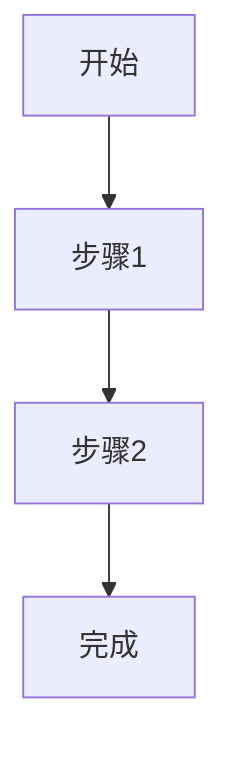

# Exchange Rate Forecaster - 项目规范

## 任务文档规范

每次 agent 完成一个任务后，**必须**在项目根目录的 `docs/` 下生成一份任务清单文档：

### 命名规则

文件名格式：`<任务主题>任务清单.md`

示例：
- `优化web布局任务清单.md`
- `添加USD-CNH汇率图表任务清单.md`
- `重构cron定时任务清单.md`

### 内容要求

1. **语言**：使用中文记录
2. **格式**：Markdown，可使用 mermaid 图展示流程
3. **结构**：
   - 任务目标（简述）
   - 执行流程（mermaid 流程图或步骤列表）
   - 变更清单（涉及的文件及修改说明）
   - 结果验证（如何确认任务完成）

### 模板参考

```markdown
# <任务主题>

## 目标

简要描述本次任务的目标。

## 执行流程



## 变更清单

| 文件路径 | 变更类型 | 说明 |
|---------|---------|------|
| `path/to/file` | 新增/修改/删除 | 具体说明 |

## 结果验证

- [ ] 验证项 1
- [ ] 验证项 2
```

## 项目结构

- `server/` - 后端服务 (Node.js)
- `admin/` - 前端管理界面 (Vue 3)
- `docs/` - 任务文档
- `exampleData/` - 示例数据
