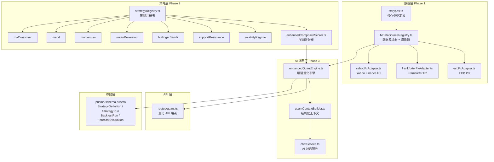
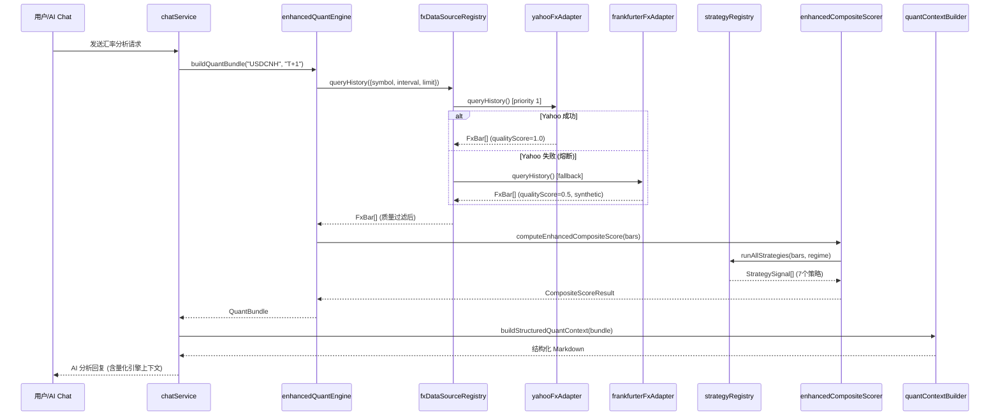

# vnpy 量化算法方案 — 实现清单

> 基于 `vnpy量化算法方案.md` 设计，借鉴 vnpy 的数据源抽象 + 策略注册表模式，在当前 TypeScript 项目中原生实现。

## 1. 架构总览

## 2. 实现文件清单

### Phase 1: 统一 FX 数据底座

| 文件路径 | 功能说明 |
|---------|---------|
| `server/src/services/quant/fxTypes.ts` | 核心类型: FxBar, HistoryRequest, QuantStrategy, QuantBundle, StrategySignal, CompositeScoreResult |
| `server/src/services/quant/fxDataSourceRegistry.ts` | 数据源注册表 + 优先级路由 + 熔断器 (5次失败/1h冷却) + 质量过滤 |
| `server/src/services/quant/sources/yahooFxAdapter.ts` | Yahoo Finance 适配器 (priority=1, 真实 OHLC, qualityScore=1.0) |
| `server/src/services/quant/sources/frankfurterFxAdapter.ts` | Frankfurter 适配器 (priority=2, 合成数据, qualityScore=0.5) |
| `server/src/services/quant/sources/ecbFxAdapter.ts` | ECB 适配器 (priority=3, 合成数据, qualityScore=0.3) |

### Phase 2: 策略注册表

| 文件路径 | 功能说明 |
|---------|---------|
| `server/src/services/quant/strategy/strategyRegistry.ts` | 策略注册表 + regime-aware 筛选 + 统一执行器 |
| `server/src/services/quant/strategy/utils.ts` | FxBar→QuantBar 转换、方向判定、数据质量影响计算 |
| `server/src/services/quant/strategy/maCrossoverStrategy.ts` | 均线交叉策略 (支持合成数据) |
| `server/src/services/quant/strategy/macdStrategy.ts` | MACD 策略 (支持合成数据) |
| `server/src/services/quant/strategy/momentumStrategy.ts` | 动量策略 (支持合成数据) |
| `server/src/services/quant/strategy/meanReversionStrategy.ts` | 均值回归策略 (支持合成数据) |
| `server/src/services/quant/strategy/bollingerBandsStrategy.ts` | 布林带策略 (仅真实数据) |
| `server/src/services/quant/strategy/supportResistanceStrategy.ts` | 支撑阻力策略 (仅真实数据) |
| `server/src/services/quant/strategy/volatilityRegimeStrategy.ts` | 波动率状态策略 (仅真实数据, volatile/ranging 专用) |
| `server/src/services/quant/strategy/index.ts` | 统一导出 |
| `server/src/services/quant/enhancedCompositeScorer.ts` | 注册表驱动评分器 (regime-aware + quality-aware 加权) |

### Phase 3: AI 消费层

| 文件路径 | 功能说明 |
|---------|---------|
| `server/src/services/quant/enhancedQuantEngine.ts` | 增强量化引擎: `runEnhancedQuantAnalysis` + `buildQuantBundle` |
| `server/src/services/quant/quantContextBuilder.ts` | QuantBundle → 结构化 Markdown (供 AI system prompt 消费) |
| `server/src/services/ai/chatService.ts` | 升级 `buildQuantSection`，优先使用 QuantBundle；系统提示词增加量化引擎说明 |

### API 端点 & 数据库

| 文件路径 | 功能说明 |
|---------|---------|
| `server/src/routes/quant.ts` | 新增 4 个端点 (见下表) |
| `prisma/schema.prisma` | 新增 4 张表 + 扩展已有表字段 |

## 3. 新增 API 端点

| 方法 | 路径 | 说明 |
|------|------|------|
| POST | `/api/v1/quant/enhanced/trigger` | 触发增强量化分析 (支持 symbol/interval/days 参数) |
| GET | `/api/v1/quant/bundle` | 获取完整 QuantBundle (AI 上下文包) |
| GET | `/api/v1/quant/strategies` | 列出所有注册策略及其元信息 |
| GET | `/api/v1/quant/adapters` | 列出所有数据源适配器及优先级 |

## 4. 数据流时序图

## 5. 新增数据库表

| 表名 | 用途 |
|------|------|
| `StrategyDefinition` | 策略元信息注册 (key, version, category, paramsSchema) |
| `StrategyRun` | 每次策略执行记录 (score, confidence, direction, evidence) |
| `BacktestRun` | 回测结果 (hitRate, avgReturnBp, maxDrawdownBp) |
| `ForecastEvaluation` | 预测评估 (predicted vs realized direction) |

扩展字段:
- `NormalizedMarketSnapshot`: +interval, +isSynthetic, +qualityScore, +sourceTraceJson, +canonicalSymbol, +sourceSymbol, +proxyFor, +basisRiskLevel
- `PredictionResult`: +quantSignalSnapshotId, +quantDatasetVersion, +quantEvidenceJson
- `RawMarketData`: +requestUrl, +responseStatus, +datasetVersion

## 6. 前端展示位置

| 组件 | 路径 | 功能 |
|------|------|------|
| QuantSignalPanel | `web/src/components/QuantSignalPanel.vue` | 量化信号面板 (行情分析页) |
| QuantRadarChart | `web/src/components/QuantRadarChart.vue` | 策略雷达图 |
| ChatPanel | `web/src/components/ChatPanel.vue` | AI 预测问答 (消费 QuantBundle 上下文) |
| quant store | `web/src/stores/quant.ts` | 量化状态管理 |

## 7. 设计决策

| 决策 | 选择 | 原因 |
|------|------|------|
| 是否引入 vnpy 运行时 | 否，借鉴抽象原生实现 | 避免 Python 依赖，保持 TypeScript 单栈 |
| 数据源降级策略 | 优先级 + 熔断器 | Yahoo 真实数据优先，失败自动降级到合成源 |
| 合成数据处理 | 标记 + 质量加权 | 合成数据仍可用于趋势类策略，但降低权重 |
| 策略接口设计 | 统一 QuantStrategy 接口 | 可插拔，新策略只需实现 evaluate() 并注册 |
| AI 上下文格式 | 结构化 Markdown + 质量标注 | AI 可感知数据质量，给出更审慎的判断 |
