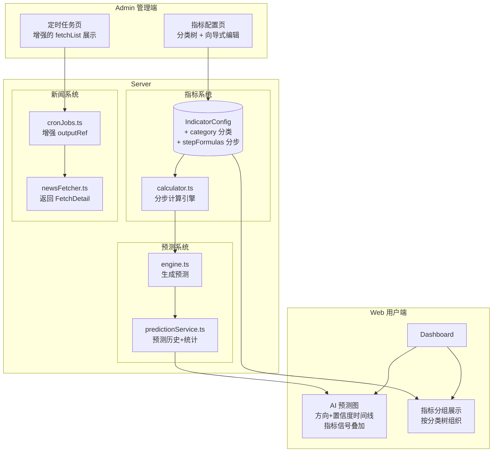
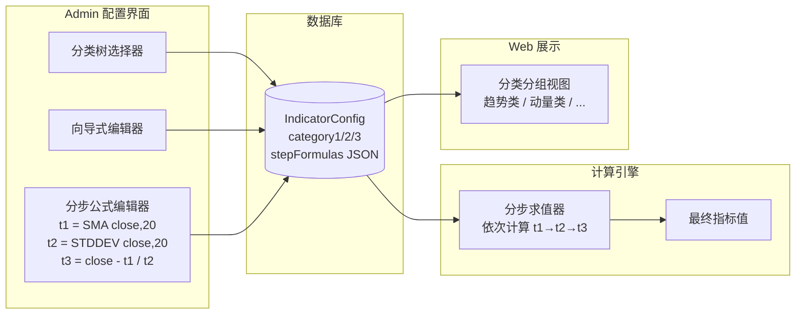
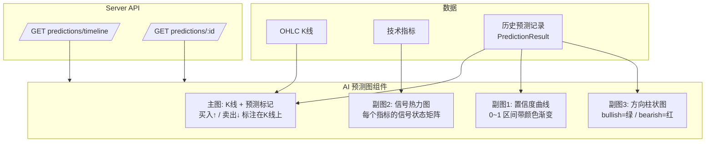

# 汇率预测机二期 TRD (Technical Requirements Document)

## 目录

1. [需求概览](#1-需求概览)
2. [系统架构图](#2-系统架构图)
3. [模块一：指标配置系统重构 (Admin + Web)](#3-模块一指标配置系统重构)
4. [模块二：定时任务 news_fetch 输出增强](#4-模块二定时任务-news_fetch-输出增强)
5. [模块三：AI 预测图可视化 (Web)](#5-模块三ai-预测图可视化)
6. [数据模型变更](#6-数据模型变更)
7. [接口设计](#7-接口设计)
8. [实施计划](#8-实施计划)

---

## 1. 需求概览

| 编号 | 模块 | 需求描述 | 涉及端 |
|------|------|----------|--------|
| R1 | 指标配置 | 重新设计指标配置界面，降低配置门槛 | Admin |
| R2 | 指标配置 | 新增分类字段（最多三级），Web 端按分类分组展示 | Admin + Web |
| R3 | 指标配置 | 支持"分步计算"数据方法（如 t3=fn(t1,t2)） | Admin + Server |
| R4 | 定时任务 | news_fetch outputRef 增加 fetchList 及其他必要信息 | Admin + Server |
| R5 | 预测展示 | 新增 AI 预测图可视化页面 | Web + Server |

---

## 2. 系统架构图

### 2.1 二期改造全局视图



### 2.2 指标配置数据流



### 2.3 AI 预测图数据流



---

## 3. 模块一：指标配置系统重构

### 3.1 当前问题分析

**当前 IndicatorConfigPage.vue 的问题**:

1. **配置门槛高**: 用户需要手写 mathjs 表达式、手动输入 JSON 格式的参数和阈值
2. **无分类组织**: 所有指标平铺在一个表格中，内置和自定义混在一起
3. **不支持分步计算**: 无法定义中间变量（如 t1=SMA(close,20), t2=close-t1），只能写在一个表达式里
4. **创建表单简陋**: 底部一行 input 紧密排列，体验差

### 3.2 指标分类体系设计

新增三级分类字段，用于组织和展示指标：

```
一级分类 (category1)         二级分类 (category2)        三级分类 (category3)
─────────────────────────   ─────────────────────────  ─────────────────────────
趋势类 (trend)               均线 (moving_average)       -
                             趋势强度 (trend_strength)   -
                             云图 (cloud)                -
动量类 (momentum)            震荡器 (oscillator)         -
                             速率 (rate)                 -
波动率类 (volatility)        通道 (channel)              -
                             统计 (statistical)          -
支撑阻力类 (support_resist)  枢轴 (pivot)                -
                             回撤 (retracement)          -
自定义 (custom)              用户自定义的二级分类         用户自定义的三级分类
```

**内置指标分类映射**:

| 指标 | category1 | category2 | category3 |
|------|-----------|-----------|-----------|
| RSI | momentum | oscillator | - |
| Stochastic | momentum | oscillator | - |
| CCI | momentum | oscillator | - |
| ADX | trend | trend_strength | - |
| AO | momentum | rate | - |
| MOM | momentum | rate | - |
| MACD (新增) | trend | moving_average | - |
| Bollinger (新增) | volatility | channel | - |
| Ichimoku (新增) | trend | cloud | - |
| Pivot Points (新增) | support_resist | pivot | - |
| Fibonacci (新增) | support_resist | retracement | - |

### 3.3 分步计算 (Step Formulas) 设计

**核心理念**: 将复杂公式拆解为多个有序的中间步骤，每一步的结果可被后续步骤引用。

**数据结构**:

```typescript
interface StepFormula {
  variable: string        // 变量名: "t1", "t2", "t3" 或自定义如 "ma20"
  label: string           // 显示标签: "20日均线"
  expression: string      // mathjs 表达式: "sma(close, 20)"
  description?: string    // 可选说明
}

// IndicatorConfig.stepFormulas 字段存储 JSON 数组
// 例: Bollinger Bands 的分步计算
[
  { "variable": "middle", "label": "中轨", "expression": "sma(close, period)" },
  { "variable": "std",    "label": "标准差", "expression": "stddev(close, period)" },
  { "variable": "upper",  "label": "上轨", "expression": "middle + multiplier * std" },
  { "variable": "lower",  "label": "下轨", "expression": "middle - multiplier * std" }
]
```

**计算引擎处理流程**:

```
Step 1: 解析 stepFormulas JSON
Step 2: 按顺序依次计算每个 step
  - 当前 step 可引用: OHLC 字段 + params 参数 + 前序 step 的变量名
  - 例: "upper" 可以引用 "middle" 和 "std" (已在前面计算)
Step 3: 最后一个 step 的结果作为指标最终值
Step 4: 如果定义了 formulaExpression (单行公式)，则忽略 stepFormulas
```

**用户交互简化方案**:

Admin 界面提供向导式分步编辑器，而非让用户手写 JSON：

```
┌─────────────────────────────────────────────────────────────────┐
│  分步计算编辑器                                                   │
├─────────────────────────────────────────────────────────────────┤
│                                                                   │
│  步骤 1:  [middle] = [SMA ▾] 的 [close ▾], 周期 [20   ]         │
│           说明: [20日均线             ]                            │
│                                                                   │
│  步骤 2:  [std   ] = [STDDEV ▾] 的 [close ▾], 周期 [20   ]      │
│           说明: [20日标准差           ]                            │
│                                                                   │
│  步骤 3:  [upper ] = [middle] + [multiplier] × [std]             │
│           说明: [上轨                 ]              [自定义表达式] │
│                                                                   │
│  步骤 4:  [lower ] = [middle] - [multiplier] × [std]             │
│           说明: [下轨                 ]              [自定义表达式] │
│                                                                   │
│  [+ 添加步骤]                                                     │
│                                                                   │
│  ── 快捷模板 ──                                                   │
│  [N日均线] [布林带] [动量变化率] [均线交叉] [价格偏离度]          │
│                                                                   │
└─────────────────────────────────────────────────────────────────┘
```

每个步骤有两种模式：
- **快捷模式**: 下拉选择函数 + 字段 + 参数（适合常见计算）
- **自定义模式**: 切换为自由文本 mathjs 表达式（适合高级用户）

### 3.4 Admin 指标配置页重构方案

**整体布局改为左右分栏**:

```
┌────────────────────────────────────────────────────────────────────────┐
│  指标公式配置                                                          │
│  OHLC 数据 → [指标计算器] → 信号判定 → 综合预测                       │
├──────────────────────────┬─────────────────────────────────────────────┤
│                          │                                             │
│  ┌────────────────────┐  │  ┌───────────────────────────────────────┐  │
│  │ 分类导航树          │  │  │ 指标列表 (当前分类下)                  │  │
│  │                     │  │  │                                       │  │
│  │ ▾ 趋势类           │  │  │ ┌─────┬──────┬──────┬──────┬───────┐ │  │
│  │   ├ 均线            │  │  │ │ 启用 │ 名称  │ 类型  │ 权重  │ 操作  │ │  │
│  │   ├ 趋势强度        │  │  │ ├─────┼──────┼──────┼──────┼───────┤ │  │
│  │   └ 云图            │  │  │ │ ✓   │ MACD │ 内置  │ 1.0  │ 编辑  │ │  │
│  │ ▾ 动量类           │  │  │ │ ✓   │ RSI  │ 内置  │ 1.0  │ 编辑  │ │  │
│  │   ├ 震荡器          │  │  │ └─────┴──────┴──────┴──────┴───────┘ │  │
│  │   └ 速率            │  │  │                                       │  │
│  │ ▾ 波动率类         │  │  │ [+ 新建指标]                           │  │
│  │ ▾ 支撑阻力类       │  │  └───────────────────────────────────────┘  │
│  │ ▾ 自定义           │  │                                             │
│  │   └ [+ 新建分类]   │  │  ┌───────────────────────────────────────┐  │
│  │                     │  │  │ 公式构建 & 预览 (选中指标时)           │  │
│  └────────────────────┘  │  │ [向导式分步编辑器 / 自由表达式]        │  │
│                          │  │ [参数配置] [信号阈值] [权重]            │  │
│                          │  │ [预览图表]                              │  │
│                          │  └───────────────────────────────────────┘  │
│                          │                                             │
├──────────────────────────┴─────────────────────────────────────────────┤
│  OHLC 数据预览 (可折叠)                                                │
└────────────────────────────────────────────────────────────────────────┘
```

**创建指标改为对话框/抽屉式**:

当前底部一行紧凑的 input 改为完整的创建对话框，包含：
1. 基本信息 (类型、名称、描述)
2. 分类选择 (三级下拉或创建新分类)
3. 计算方式选择 (分步向导 / 自由表达式)
4. 参数定义 (可视化添加，非手写 JSON)
5. 信号阈值 (可视化配置，非手写 JSON)
6. 权重设置 (滑块)

**编辑对话框增强**:

当前编辑对话框新增：
- 分类选择器 (三级级联选择)
- 分步公式编辑器 Tab (与现有的自由表达式 Tab 并列)
- 参数和阈值使用表单控件替代 JSON 手写

### 3.5 Web 端分类分组展示

当前 `IndicatorCardGroup.vue` 按平铺方式展示所有指标卡片，改为按分类分组：

```
┌─────────────────────────────────────────────────────┐
│  技术指标                                             │
├─────────────────────────────────────────────────────┤
│                                                       │
│  趋势类                                               │
│  ┌──────────┐ ┌──────────┐ ┌──────────┐             │
│  │ MACD     │ │ ADX      │ │ Ichimoku │             │
│  │ ▲ 买入   │ │ 强趋势   │ │ ▲ 买入   │             │
│  │ 0.0045   │ │ 28.5     │ │ 云上方   │             │
│  └──────────┘ └──────────┘ └──────────┘             │
│                                                       │
│  动量类                                               │
│  ┌──────────┐ ┌──────────┐ ┌──────────┐ ┌────────┐  │
│  │ RSI-14   │ │ Stoch    │ │ CCI-20   │ │ MOM-10 │  │
│  │ 58.3     │ │ 42.1     │ │ -85.6    │ │ +0.012 │  │
│  │ 中性     │ │ 中性     │ │ ▲ 买入   │ │ ▲ 买入 │  │
│  └──────────┘ └──────────┘ └──────────┘ └────────┘  │
│                                                       │
│  波动率类                                             │
│  ┌──────────────┐                                    │
│  │ Bollinger    │                                    │
│  │ 上: 7.265    │                                    │
│  │ 中: 7.245    │                                    │
│  │ 下: 7.225    │                                    │
│  └──────────────┘                                    │
│                                                       │
│  (无指标的分类不显示)                                  │
│                                                       │
└─────────────────────────────────────────────────────┘
```

**展示规则**:
- 按 category1 分组，组内按 category2 排序
- 只展示有 enabled=true 指标的分类
- 空分类不渲染
- 分类名称使用中文映射

---

## 4. 模块二：定时任务 news_fetch 输出增强

### 4.1 当前问题分析

当前 `cronJobs.ts` 中 news_fetch 的 `outputRef` 仅记录:

```json
{ "fetchedCount": 15 }
```

缺少关键信息：拉取了哪些新闻、每个源的拉取状态、具体的新闻条目列表。

### 4.2 增强后的 outputRef 结构

```typescript
interface NewsFetchOutput {
  fetchedCount: number          // 总插入条数 (保留兼容)
  totalSources: number          // 本次涉及的数据源数量
  totalItemsRaw: number         // 原始抓取条数 (去重前)
  durationMs: number            // 总耗时
  fetchList: FetchSourceDetail[] // 每个源的拉取明细
}

interface FetchSourceDetail {
  sourceName: string            // 数据源名称 (如 "金十数据")
  sourceId: string              // 数据源 ID
  sourceType: string            // "rss" | "json-api" | "curl" | ...
  status: "success" | "error" | "skipped"
  itemCount: number             // 该源拉取的条目数
  insertedCount: number         // 该源实际插入的条目数 (去重后)
  durationMs: number            // 该源耗时
  error?: string                // 失败时的错误信息
  items: FetchedItemSummary[]   // 具体拉取的新闻条目
}

interface FetchedItemSummary {
  title: string                 // 新闻标题
  url: string                   // 新闻链接
  publishedAt: string | null    // 发布时间
  category: string | null       // 分类
  isNew: boolean                // 是否为新条目 (非重复)
}
```

**示例 outputRef**:

```json
{
  "fetchedCount": 23,
  "totalSources": 5,
  "totalItemsRaw": 45,
  "durationMs": 3200,
  "fetchList": [
    {
      "sourceName": "金十数据",
      "sourceId": "clx...",
      "sourceType": "json-api",
      "status": "success",
      "itemCount": 12,
      "insertedCount": 8,
      "durationMs": 800,
      "items": [
        {
          "title": "美联储官员暗示年内仍有降息空间",
          "url": "https://...",
          "publishedAt": "2026-05-06T08:30:00Z",
          "category": "央行政策",
          "isNew": true
        },
        {
          "title": "中国4月CPI同比上涨1.2%",
          "url": "https://...",
          "publishedAt": "2026-05-06T09:00:00Z",
          "category": "经济数据",
          "isNew": false
        }
      ]
    },
    {
      "sourceName": "华尔街见闻",
      "sourceId": "clx...",
      "sourceType": "curl",
      "status": "error",
      "itemCount": 0,
      "insertedCount": 0,
      "durationMs": 5000,
      "error": "Request timeout after 5000ms"
    }
  ]
}
```

### 4.3 改造点

#### 4.3.1 Server 端

**newsFetcher.ts** — `fetchAllNews()` 返回值改造:

```typescript
// 当前
export async function fetchAllNews(): Promise<number>

// 改造后
export async function fetchAllNews(): Promise<NewsFetchOutput>
```

需要在 `fetchSingleSource()` 内收集每个源的详细结果（条目列表、耗时、状态）并返回。

**cronJobs.ts** — outputRef 写入完整数据:

```typescript
// 当前
outputRef: JSON.stringify({ fetchedCount: count })

// 改造后
outputRef: JSON.stringify(fetchOutput) // 完整的 NewsFetchOutput
```

#### 4.3.2 Admin 端 — CronJobsPage.vue 展示增强

在现有的定时任务卡片中，增加最近一次执行的 fetchList 展示：

```
┌──────────────────────────────────────────────────────────┐
│  News Fetch                                    [运行中]   │
│  ...现有的倒计时、统计、描述信息...                         │
│                                                           │
│  ── 最近执行详情 ──                                       │
│                                                           │
│  总计: 5个源 → 45条原始 → 23条入库  耗时: 3.2s           │
│                                                           │
│  ┌────────────┬──────┬───────┬────────┬────────────────┐ │
│  │ 数据源      │ 状态  │ 抓取  │ 入库   │ 耗时            │ │
│  ├────────────┼──────┼───────┼────────┼────────────────┤ │
│  │ 金十数据    │ ✅   │ 12    │ 8      │ 0.8s           │ │
│  │ 财联社      │ ✅   │ 10    │ 6      │ 1.1s           │ │
│  │ 东方财富    │ ✅   │ 15    │ 9      │ 0.9s           │ │
│  │ 新浪财经    │ ✅   │ 8     │ 0      │ 0.4s           │ │
│  │ 华尔街见闻  │ ❌   │ -     │ -      │ 5.0s (超时)    │ │
│  └────────────┴──────┴───────┴────────┴────────────────┘ │
│                                                           │
│  [展开查看拉取条目 ▾]                                      │
│                                                           │
│  金十数据 (8条新条目):                                     │
│  ● 美联储官员暗示年内仍有降息空间      09:30  [央行政策]   │
│  ● 中国4月CPI同比上涨1.2%             09:00  [经济数据]   │
│  ● ...                                                    │
│                                                           │
└──────────────────────────────────────────────────────────┘
```

---

## 5. 模块三：AI 预测图可视化 (Web)

### 5.1 需求描述

在 Web 端新增"AI 预测图"可视化功能，将历史预测结果以图表形式展现，让用户直观看到：
- 预测方向在时间轴上的分布
- 预测置信度的变化趋势
- 各指标信号与最终预测的关系
- 预测命中情况（如有回测数据）

### 5.2 整体设计

AI 预测图作为 DashboardPage 的一个新区域，嵌入到 MarketChart 与 IndicatorCharts 之间。

**组件结构**:

```
PredictionChartPanel (容器)
├── PredictionMainChart      — 主图: K线 + 预测标记点
├── ConfidenceChart          — 副图1: 置信度曲线
├── SignalHeatmap            — 副图2: 指标信号热力图
└── PredictionSummaryStats   — 右侧: 统计摘要卡片
```

### 5.3 主图: K线 + 预测标记

在现有 K 线图上叠加预测标记:

```
价格 ▲
     │        ╻
     │    ╻   ┃  ╻      ╻
     │    ┃   ┃  ┃  ╻   ┃
     │ ╻  ┃   ╻  ┃  ┃   ╻
     │ ┃  ╻      ╻  ┃
     │ ╻              ╻
     │
     │ ▲     ▲        ▼        ▲     ← 预测标记
     │ 看多  看多      看空     看多
     │ 0.72  0.58     0.81     0.65   ← 置信度
     └──────────────────────────────▶ 时间
```

**标记规则**:
- `▲` 绿色向上箭头 = bullish 预测
- `▼` 红色向下箭头 = bearish 预测
- `◆` 灰色菱形 = neutral 预测
- 标记大小与置信度成正比
- 鼠标悬停显示完整预测详情 (方向、置信度、rationale、时间)

**ECharts 实现**: 使用 `markPoint` + `scatter` 系列叠加在 K 线图上。

### 5.4 副图1: 置信度时间线

```
置信度
1.0 ┤
    │         ╱╲
0.8 ┤        ╱  ╲      ╱╲
    │       ╱    ╲    ╱  ╲
0.6 ┤  ╱╲  ╱      ╲  ╱    ╲
    │ ╱  ╲╱        ╲╱      ╲
0.4 ┤╱                      ╲
    │   绿=bullish  红=bearish  灰=neutral
0.0 ┤
    └─────────────────────────────▶ 时间
```

- 折线图展示置信度数值变化
- 线段颜色按预测方向着色 (bullish=绿, bearish=红, neutral=灰)
- 背景色带标注高置信度区间 (>0.7 高亮)

### 5.5 副图2: 指标信号热力图

```
         D1    D2    D3    D4    D5    D6    D7
RSI     [🟢] [🟢] [⚪] [⚪] [🔴] [🔴] [🟢]
STOCH   [🟢] [⚪] [⚪] [🔴] [🔴] [⚪] [🟢]
CCI     [⚪] [🟢] [🟢] [⚪] [🔴] [⚪] [⚪]
MACD    [🟢] [🟢] [🟢] [⚪] [⚪] [🔴] [🟢]
ADX强度 [██] [██] [▓▓] [▒▒] [██] [██] [▓▓]
─────── ─────────────────────────────────────
预测    [▲]  [▲]  [◆]  [◆]  [▼]  [▼]  [▲]
```

- 矩阵形式展示每个时间点每个指标的信号
- 🟢 = buy, 🔴 = sell, ⚪ = neutral
- ADX 用渐变色条表示趋势强度
- 底部一行显示最终预测结果

**ECharts 实现**: 使用 `heatmap` 图表类型。

### 5.6 统计摘要卡片

```
┌──────────────────────────┐
│  预测统计 (近30天)         │
├──────────────────────────┤
│  总预测数:    45          │
│  看多:   22 (49%)         │
│  看空:   18 (40%)         │
│  震荡:    5 (11%)         │
│                           │
│  平均置信度: 0.62         │
│  最高置信度: 0.89         │
│                           │
│  当前信号一致性: 4/6      │
│  (4个指标方向一致)         │
│                           │
│  ── 最新预测 ──           │
│  方向: 📈 看多            │
│  置信度: 68%              │
│  时间: 2分钟前            │
│  周期: T+2                │
└──────────────────────────┘
```

### 5.7 DashboardPage 集成方案

在现有 DashboardPage 布局中，AI 预测图插入到 MarketChart 下方:

```
┌────────────────────────────────────────────────────────┐
│ Dashboard Header                                        │
├──────────────────┬─────────────────────────────────────┤
│                  │ MarketChart (K线图)                   │
│  ChatPanel       ├─────────────────────────────────────┤
│                  │ AI 预测图 (新增)                      │
│                  │ ┌─────────────────┬────────────────┐ │
│                  │ │ 主图+置信度+热力 │ 统计摘要卡片   │ │
│                  │ └─────────────────┴────────────────┘ │
│                  ├─────────────────────────────────────┤
│                  │ IndicatorCharts + IndicatorCards      │
├──────────────────┴─────────────────────────────────────┤
```

---

## 6. 数据模型变更

### 6.1 IndicatorConfig 表修改

```prisma
model IndicatorConfig {
  id                String   @id @default(cuid())
  indicatorType     String   @unique
  displayName       String
  description       String?  @db.Text

  // === 新增: 三级分类 ===
  category1         String   @default("custom")    // trend/momentum/volatility/support_resist/custom
  category2         String?                         // oscillator/rate/channel/...
  category3         String?                         // 可选第三级

  formulaLatex      String?  @db.Text
  formulaExpression String?  @db.Text

  // === 新增: 分步公式 ===
  stepFormulas      String?  @db.Text               // JSON: StepFormula[]

  params            String   @db.Text
  signalThresholds  String   @db.Text
  enabled           Boolean  @default(true)
  weight            Float    @default(1.0)

  // === 新增: 展示控制 ===
  chartType         String   @default("line")       // "line" | "bar" | "band" | "cloud" | "levels"
  subChart          Boolean  @default(true)          // 是否在副图显示

  createdAt         DateTime @default(now())
  updatedAt         DateTime @updatedAt

  @@index([category1, category2])
}
```

### 6.2 PredictionResult 表修改

```prisma
model PredictionResult {
  id               String   @id @default(cuid())
  symbol           String
  userQuery        String   @db.Text
  horizon          String
  direction        String
  confidence       Float
  rationale        String   @db.Text
  riskNotes        String   @db.Text
  modelVersion     String
  dataSnapshotRefs String   @db.Text

  // === 新增: 指标快照 (用于预测图信号热力图) ===
  signalsSnapshot    String?  @db.Text    // JSON: { rsi: "buy", stoch: "sell", ... }
  indicatorsSnapshot String?  @db.Text    // JSON: { rsi14: 35.2, stochK: 22.5, ... }

  createdAt        DateTime @default(now())

  @@index([symbol, createdAt])
}
```

### 6.3 分类枚举映射 (前端常量)

```typescript
export const CATEGORY1_MAP: Record<string, string> = {
  trend: "趋势类",
  momentum: "动量类",
  volatility: "波动率类",
  support_resist: "支撑阻力类",
  custom: "自定义",
}

export const CATEGORY2_MAP: Record<string, string> = {
  moving_average: "均线",
  trend_strength: "趋势强度",
  cloud: "云图",
  oscillator: "震荡器",
  rate: "速率",
  channel: "通道",
  statistical: "统计",
  pivot: "枢轴",
  retracement: "回撤",
}
```

---

## 7. 接口设计

### 7.1 指标配置 API 变更

**PUT /api/v1/admin/indicator-configs/:id** — 请求体新增字段:

```typescript
{
  // ...现有字段...
  category1?: string
  category2?: string
  category3?: string
  stepFormulas?: string    // JSON: StepFormula[]
  chartType?: string
  subChart?: boolean
}
```

**POST /api/v1/admin/indicator-configs** — 创建时新增字段:

```typescript
{
  indicatorType: string
  displayName: string
  description?: string
  category1: string         // 必填
  category2?: string
  category3?: string
  formulaExpression?: string
  stepFormulas?: string     // JSON: StepFormula[]
  params: string
  signalThresholds: string
  weight?: number
  chartType?: string
  subChart?: boolean
}
```

**POST /api/v1/admin/indicator-configs/validate-step-formulas** — 新增:

```typescript
// Request
{
  stepFormulas: StepFormula[]
  params: Record<string, number>
}

// Response
{
  code: 0,
  data: {
    valid: boolean
    errors: { step: number; variable: string; error: string }[]
    preview: { variable: string; sampleValues: number[] }[]
  }
}
```

**GET /api/v1/admin/indicator-categories** — 新增:

```typescript
// Response
{
  code: 0,
  data: [
    {
      value: "trend",
      label: "趋势类",
      children: [
        { value: "moving_average", label: "均线", count: 2 },
        { value: "trend_strength", label: "趋势强度", count: 1 }
      ]
    }
  ]
}
```

### 7.2 定时任务 API 变更

**GET /api/v1/admin/cron/latest-output/:taskType** — 新增:

```typescript
// Response
{
  code: 0,
  data: {
    taskLogId: string
    taskType: "news_fetch"
    status: "success"
    startedAt: string
    finishedAt: string
    durationMs: number
    output: NewsFetchOutput   // 完整的 fetchList
  }
}
```

### 7.3 预测图 API (新增)

**GET /api/v1/predictions/timeline**

```typescript
// Query: ?symbol=USDCNH&days=30&limit=100
// Response
{
  code: 0,
  data: {
    predictions: {
      id: string
      direction: "bullish" | "bearish" | "neutral"
      confidence: number
      horizon: string
      rationale: string[]
      signals: Record<string, "buy" | "sell" | "neutral">
      indicators: Record<string, number>
      createdAt: string
    }[],
    stats: {
      total: number
      bullishCount: number
      bearishCount: number
      neutralCount: number
      avgConfidence: number
      maxConfidence: number
    }
  }
}
```

**GET /api/v1/predictions/:id**

```typescript
// Response
{
  code: 0,
  data: {
    id: string
    symbol: string
    direction: string
    confidence: number
    horizon: string
    rationale: string[]
    riskNotes: string[]
    signals: Record<string, string>
    indicators: Record<string, number>
    createdAt: string
    ohlcSnapshot: {
      open: number
      high: number
      low: number
      close: number
      tradeDate: string
    } | null
  }
}
```

---

## 8. 实施计划

### Phase 1: 数据模型 & Server 基础 (2 天)

| 任务 | 工时 | 说明 |
|------|------|------|
| Prisma schema: IndicatorConfig 新增字段 | 0.5h | category1/2/3, stepFormulas, chartType, subChart |
| Prisma schema: PredictionResult 新增字段 | 0.5h | signalsSnapshot, indicatorsSnapshot |
| 数据迁移脚本 (现有指标填充默认分类) | 1h | RSI→momentum/oscillator 等 |
| calculator.ts 分步公式引擎 | 3h | evaluateStepFormulas() |
| newsFetcher.ts 返回值改造 | 2h | 收集每源详情，返回 NewsFetchOutput |
| cronJobs.ts 输出格式更新 | 1h | 写入完整 outputRef |
| engine.ts 保存信号快照 | 1h | 写入 signalsSnapshot + indicatorsSnapshot |

### Phase 2: 新增 API 端点 (1 天)

| 任务 | 工时 | 说明 |
|------|------|------|
| GET /admin/indicator-categories | 1h | 分类树聚合 |
| POST /admin/indicator-configs/validate-step-formulas | 1h | 分步公式验证 |
| GET /admin/cron/latest-output/:taskType | 1h | 最近执行详情 |
| GET /predictions/timeline | 2h | 预测时间线+统计 |
| GET /predictions/:id | 1h | 预测详情 |
| 现有 indicator-config CRUD 适配新字段 | 1h | |

### Phase 3: Web AI 预测图 (2-3 天)

| 任务 | 工时 | 说明 |
|------|------|------|
| PredictionChartPanel 容器组件 | 1h | 布局+数据获取 |
| PredictionMainChart (K线+标记) | 3h | ECharts markPoint |
| ConfidenceChart (置信度曲线) | 2h | 分色折线图 |
| SignalHeatmap (信号热力图) | 3h | ECharts heatmap |
| PredictionSummaryStats (统计卡片) | 1h | |
| DashboardPage 集成 | 1h | 插入新区域 |

### Phase 4: Admin 指标配置页重构 (2-3 天)

| 任务 | 工时 | 说明 |
|------|------|------|
| 分类导航树组件 | 3h | 左侧树+新建分类 |
| 向导式分步公式编辑器 | 4h | 核心交互组件 |
| 创建指标对话框重构 | 2h | 完整对话框替代底部 input |
| 编辑对话框增强 (分类+分步Tab) | 2h | |
| 指标表格按分类过滤 | 1h | 树节点联动 |

### Phase 5: Admin 定时任务展示增强 (0.5 天)

| 任务 | 工时 | 说明 |
|------|------|------|
| CronJobsPage fetchList 展示区域 | 2h | 源明细表格+可展开条目 |
| 调用 latest-output API | 1h | |

### Phase 6: Web 指标分类展示 (0.5 天)

| 任务 | 工时 | 说明 |
|------|------|------|
| IndicatorCardGroup 改造为分类分组 | 2h | 按 category1 分组 |
| 分类名称中文映射常量 | 0.5h | |

---

**总计预估: 8-10 天**

**推荐实施顺序**: Phase 1 → Phase 2 → Phase 3 (demo效果最强) → Phase 4 → Phase 5 → Phase 6
